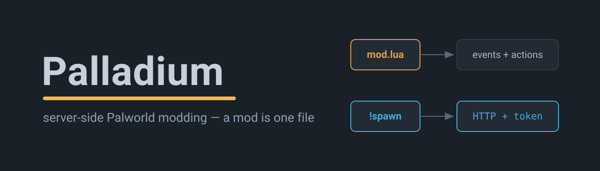
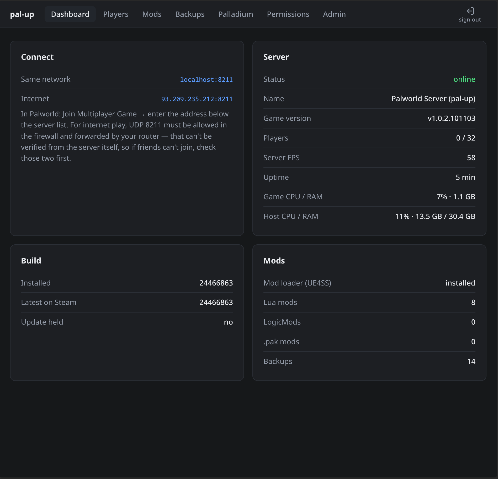
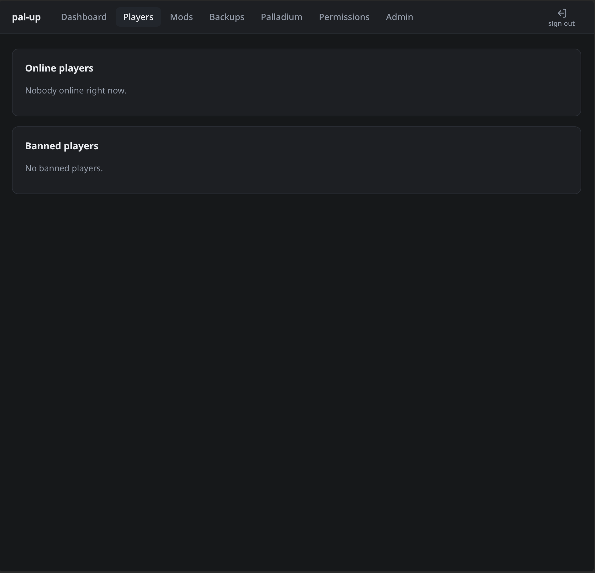
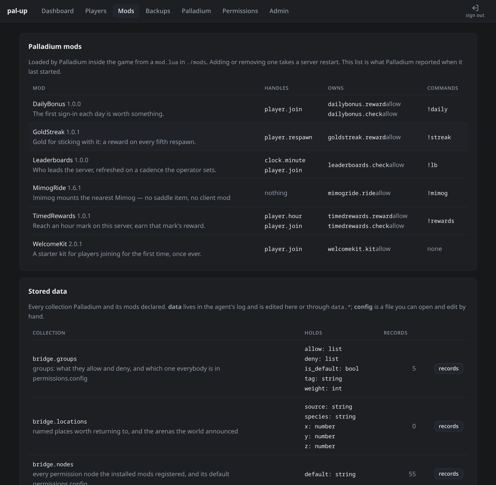
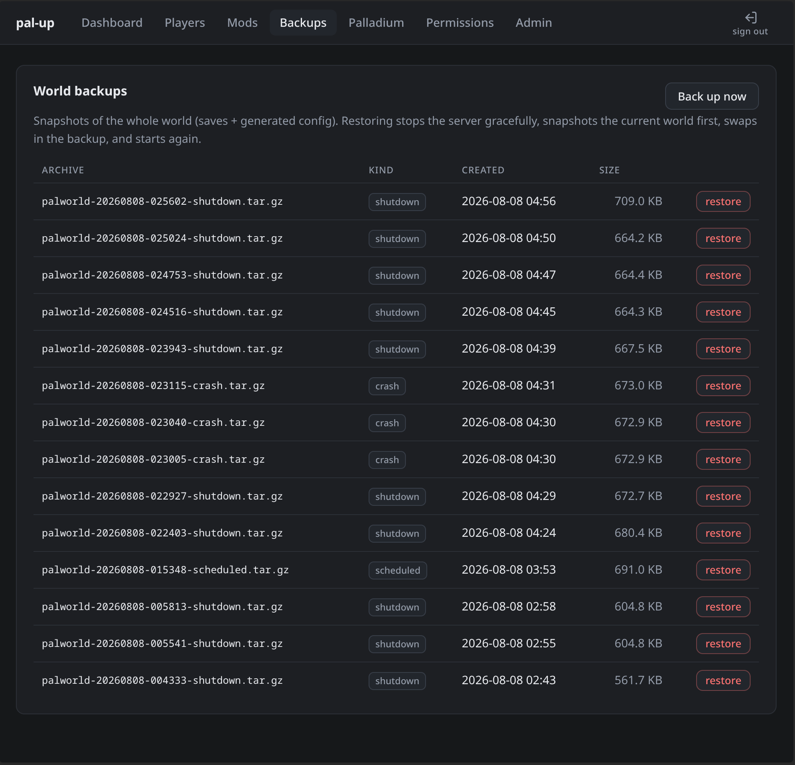
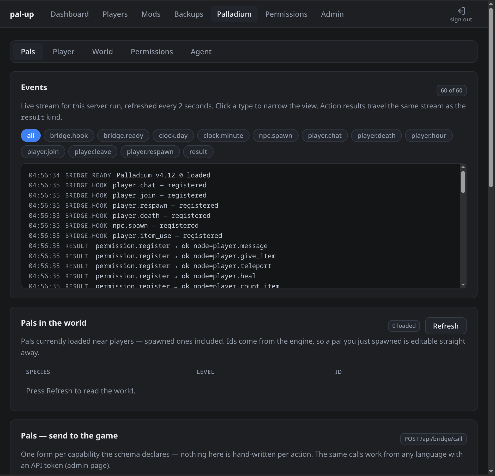
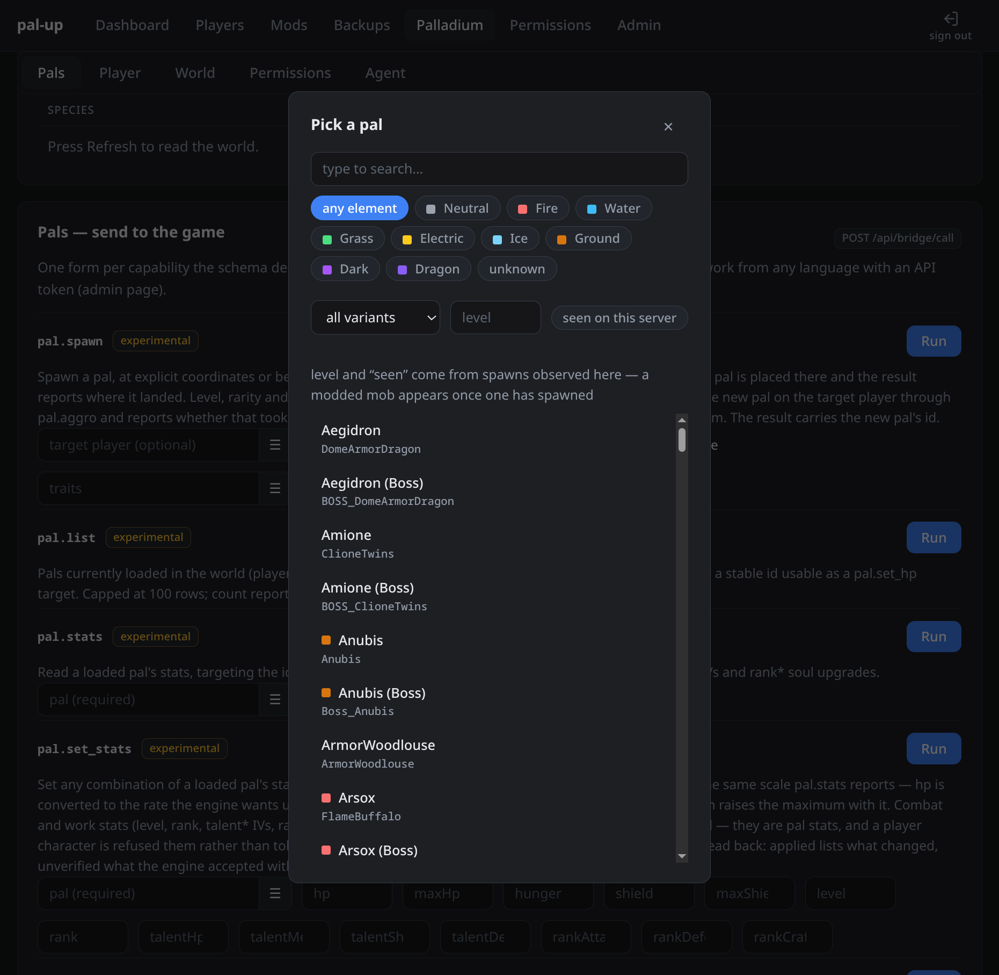
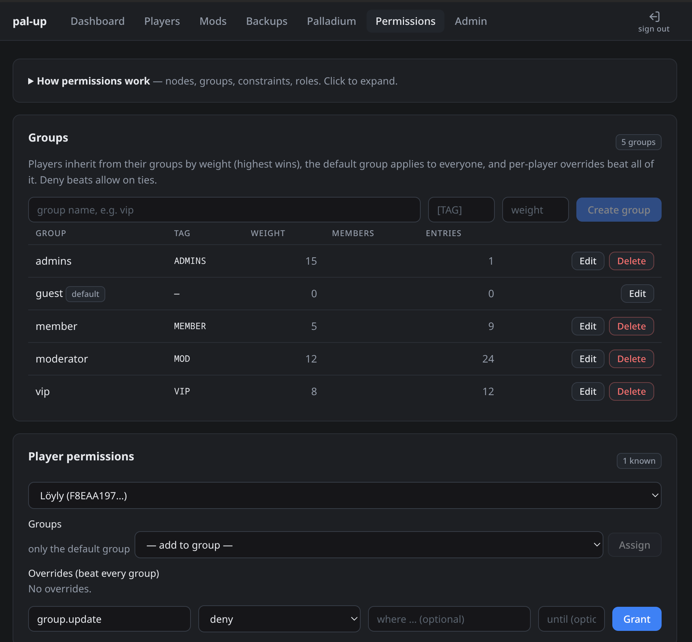
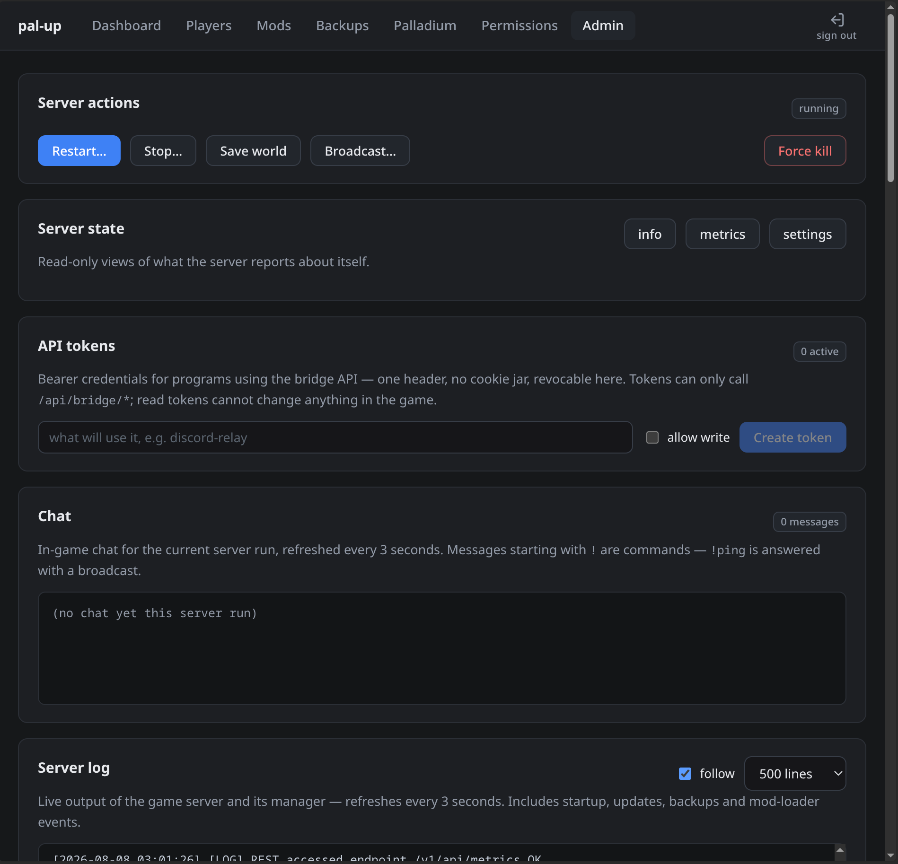

[](https://github.com/s-kiu/Palladium/actions/workflows/ci.yaml)
[](https://s-kiu.github.io/Palladium/)
[](https://github.com/s-kiu/Palladium/releases)
[](LICENSE)

**A modding framework for Palworld dedicated servers — and a Linux server that ships it ready to run.**


- **[Palladium](mods/Palladium)** is the framework: one UE4SS Lua mod, on any UE4SS dedicated server. A mod built on it is a single `mod.lua` — permissions, settings, storage, chat commands and in-game events all handled for it. [Download from releases](https://github.com/s-kiu/Palladium/releases).
- **Pal-Up** — *Palladium, up* — is the server: a modded Palworld dedicated server for Linux — which the official mod system doesn't support — in one `docker compose up`, with Palladium preinstalled, drop-in mod folders, a web panel, backups and safe updates. Clone this repo.

What each delivers — and what only the combination can:

| | **Palladium**<br>[release zip](https://github.com/s-kiu/Palladium/releases) on any UE4SS server | **Pal-Up**<br>this repo, Docker on Linux | **Both**<br>clone, `compose up` — done |
|---|:---:|:---:|:---:|
| ***The framework*** | | | |
| Lua modding — a mod is one `mod.lua` file | ✓ | | ✓ |
| Permissions: five tiers, groups, constraints, expiry, audit log | ✓ | | ✓ |
| Chat commands: `!commands`, `@me` / `@Name`, every capability gated | ✓ | | ✓ |
| In-game events and actions: chat, joins, deaths, played hours, pal spawns, items, teleports, stats | ✓ | | ✓ |
| Events and actions published to disk for local programs | ✓ | | ✓ |
| ***The server*** | | | |
| Palworld dedicated server on Linux, one `docker compose up` | | ✓ | ✓ |
| UE4SS mod loader preinstalled, checksum-pinned | | ✓ | ✓ |
| Drop-in folders for every mod kind: Lua, `.pak`, LogicMods | | ✓ | ✓ |
| Automatic backups, one-command restore, safe game updates | | ✓ | ✓ |
| Web panel and CLI: players online, kick/ban, broadcasts, logs, settings | | ✓ | ✓ |
| ***Only in combination*** | | | |
| HTTP API with tokens — drive the server from any language | | | ✓ |
| A form for every capability: searchable pickers, live event stream, stats editor | | | ✓ |
| Permissions and every mod's data edited in the browser | | | ✓ |
| Script mods in JS/TS that reach the network — a Discord relay as a drop-in folder | | | ✓ |

> [!NOTE]
> Mod loading currently ships via the community-maintained
> [UE4SS build v1.0.3-palworld-linux](https://github.com/Qiiks/ue4ss-linux-palworld/releases/tag/v1.0.3-palworld-linux),
> which carries the Linux stability fixes for the current Palworld build while
> they are merged upstream ([details](https://github.com/BlackBookOfficial/ue4ss-linux-palworld/issues/11)).
> The pin lives in [ue4ss.lock](packages/server-image/ue4ss/ue4ss.lock) and
> will move back to an upstream release once one includes the fixes.

## Features

- **Modded out of the box** — the UE4SS mod loader (native Linux build, checksum-pinned, baked into the image) is injected via `LD_PRELOAD` with headless settings applied automatically.
- **Drop-in mod folders** — `./mods` (Palladium mods, Lua mods, and script mods the panel runs), `./paks` (loose `.pak`), `./logicmods` (Blueprint mods) are synced into the correct game paths on every start, with `mods.txt` and Palladium's load list regenerated to match. Disable any mod with a `.disabled` marker file instead of deleting it — a script mod stops on the spot, the rest on the next restart.
- **Update safety** — `UPDATE_ON_BOOT=true|false|hold`. `hold` freezes the game version until your mods are confirmed compatible and logs a loud banner when a patch is waiting. The world is backed up automatically before every update.
- **Backups built in** — on graceful shutdown, before updates, and on a schedule, with retention by count and age. One-command restore that snapshots the current world first.
- **Config from env** — `PalWorldSettings.ini` is generated from `.env` (40+ mapped settings, `OPT_<IniKey>` passthrough for everything else), and `config/persist/` pins any file the game keeps resetting.
- **Admin without ceremony** — a `pal-up` CLI inside the container: player list, broadcast, kick/ban, save-now, update check, backup management, all against the server's local REST API.
- **Web panel** — sign in with the admin password at `http://<host>:3000`: live server status, one-click game updates, online players with kick/ban/unban, mod toggles, backups with one-click create and rollback, server controls with the live log, and a grouped, searchable settings editor with diff-before-apply. It needs **no docker.sock** — it drives the game through its REST API and the shared data volume.

- **A modding framework with a GUI** — [Palladium](mods/Palladium) turns the server into a platform, and the panel gives it a face: every capability rendered as a form, with searchable pickers (2,400+ items, 750+ pal species), a live event stream, a stats editor, and the permissions page pictured below. Mods that need the network run in the panel instead, in JavaScript or TypeScript.
- **Permissions that mean something** — dotted nodes with wildcards, groups by weight, per-player overrides, and constraints that narrow a grant to *"may spawn, but only Lamball below level 20"* — or to *"only yourself"* (`where target = @me`), *"only below your rank"* (`where target_weight < 12`), with `or`-alternatives and `until <date>` expiry for a VIP month that ends itself. Five tiers ship as defaults (guest → member → vip → moderator → admins), the whole system is explained line by line in [example.permissions.config](mods/Palladium/example.permissions.config), and every in-game write lands in an audit file.

- **Chat that answers back** — every capability is a chat command gated by its own node, denied by default: positional arguments matched to the declared parameters (`!spawn_wild BlueDragon_Ice 20 true`), `@me` and `@Name` targeting, `!commands` for what *you* may use, `?command` for how. Playtime is counted per player (`!playtime`), and the shipped [TimedRewards](mods/TimedRewards) mod pays it out at the hour marks you define.

The panel, page by page — click any image for full size:

<table>
  <tr>
    <td align="center"><a href="docs/img/dashboard.png"></a><br><sub>Dashboard</sub></td>
    <td align="center"><a href="docs/img/players.png"></a><br><sub>Players</sub></td>
    <td align="center"><a href="docs/img/mods.png"></a><br><sub>Mods</sub></td>
    <td align="center"><a href="docs/img/backups.png"></a><br><sub>Backups</sub></td>
  </tr>
  <tr>
    <td align="center"><a href="docs/img/palladium.png"></a><br><sub>Palladium forms</sub></td>
    <td align="center"><a href="docs/img/picker.png"></a><br><sub>Pickers</sub></td>
    <td align="center"><a href="docs/img/permissions.png"></a><br><sub>Permissions</sub></td>
    <td align="center"><a href="docs/img/admin.png"></a><br><sub>Admin</sub></td>
  </tr>
</table>

## Quickstart

### Just the mod — Palladium on a server you already run

No clone, no Docker. Download the latest `Palladium` zip from the
[releases page](https://github.com/s-kiu/Palladium/releases), drop the
`Palladium` folder into your server's UE4SS `Mods` directory, enable it, and
restart. Mods built on it go in folders right beside it. Full steps, including
where permissions and mod data land: [mods/Palladium](mods/Palladium).

### The full server — Pal-Up

Requirements: Linux x86_64, Docker with the compose plugin, ~25 GB free disk, 16 GB RAM recommended.

```bash
git clone https://github.com/s-kiu/Palladium.git && cd Palladium
cp .env.example .env
# edit .env — at minimum set ADMIN_PASSWORD

docker compose up -d --build
docker compose logs -f palworld
```

First start downloads the ~15 GB server from Steam — game files can't ship
inside the image, and the download is one-time. It is stored in a Docker
**named volume** (`palworld-data`), managed by Docker outside this project
folder — you won't see it here, and it survives rebuilds, with later game
updates fetching deltas only. Only `mods/`, `paks/`, `logicmods/` and
`backups/` live in the project folder itself.

The build fetches the pinned UE4SS release and verifies it against the checksum in [ue4ss.lock](packages/server-image/ue4ss/ue4ss.lock) — nothing is ever downloaded at container runtime.

Then connect from Palworld: **Join Multiplayer Game** → `<host-ip>:8211` (open `8211/udp` in your firewall — and only that port). The admin panel is at `http://<host-ip>:3000` — sign in with your `ADMIN_PASSWORD`, and keep this port LAN/VPN-only.

Full walkthrough: [docs/quickstart.md](docs/quickstart.md).

## Installing mods

| You have | Put it in |
|---|---|
| Palladium mod (folder with a `mod.lua`) | `./mods/CoolMod/` |
| Lua mod (folder with `scripts/main.lua`) | `./mods/CoolMod/` |
| Script mod (folder with a `mod.json`) | `./mods/CoolMod/` |
| Loose `.pak` mod | `./paks/` |
| LogicMod / Blueprint `.pak` | `./logicmods/` |

```bash
unzip CoolMod.zip -d mods/
docker compose restart palworld
```

Folder conventions, Linux caveats, and how mods survive game updates: [docs/mods.md](docs/mods.md).

## Building on top of it

[Palladium](mods/Palladium) is the framework. It runs mods inside the game, owns
permissions and everything mods store, and publishes the same events and actions
to disk for anything outside. The panel is the other half: it serves those over
HTTP, runs the mods that need a network, and gives every capability a form to
drive it from.

**Events**: `player.chat`, `player.join` (with `firstEver`), `player.leave`,
`player.death` (with killer), `player.respawn`, `npc.spawn`, `player.hour`
(a played hour completed), `clock.minute` and `clock.day` (real time, for
mods that schedule).
**Actions and queries**: message one player or announce to everyone, give item,
teleport, heal, read/set stats, tags, playtime, place a pal or have the world
spawn a real wild one — your species, your level, aggressive on request —
permissions, groups, saved locations, and a generic read/write door onto
anything a mod stores — 47 in total, [each one generated from a single
manifest with its chat form](docs/bridge-reference.md).

### Three ways to build, and how to choose

| | Palladium mod | Script mod | External program |
|---|---|---|---|
| **Is** | `mods/X/mod.lua` | `mods/X/mod.json` + `.ts`/`.mjs` | anything, anywhere |
| **Runs** | inside the game | as a panel child process | wherever you start it |
| **Needs** | Palladium only | Pal-Up | Pal-Up + an API token |
| **Install** | drop the folder in, restart | drop the folder in, ~10 s | run it |
| **Language** | Lua | JS or TS, no build step | any |
| **Reaches the network** | no — UE4SS Lua has no sockets | yes | yes |

Write a **Palladium mod** by default: it needs nothing but the framework, it
reaches the engine, and it is one file. Write a **script mod** when it has to
call out — a Discord relay, anything hitting an HTTP API. Write an **external
program** when it lives somewhere else entirely: a bot, a dashboard, a CLI.

### A mod is one file

```lua
return {
  name = "WelcomeKit",
  api = 1,                        -- which framework shape this was written for
  description = "A starter kit for players joining for the first time, once ever.",

  -- Registered for you. Operators change the default in permissions.config,
  -- and their change outranks what you asked for.
  permissions = {
    { node = "welcomekit.kit", description = "receive the starter kit on first join", default = "allow" },
  },

  -- Yours to read as pal.settings; an operator edits them without touching code.
  settings = {
    items = { { item = "PalSphere", count = 10 }, { item = "Pan", count = 5 } },
    announce = true,
  },

  on = {
    ["player.join"] = function(event, pal)
      local who, name = event.subject.id, event.subject.name
      if not event.data.firstEver or pal.tag(who, "claimed") then
        return pal.message(who, "Welcome back, " .. name .. ".")
      end
      if not pal.can(who, "welcomekit.kit") then return end

      for _, entry in ipairs(pal.settings.items) do
        pal.give(who, entry.item, entry.count)
      end
      pal.set_tag(who, "claimed", os.time())      -- survives restarts
      pal.message(who, "Welcome, " .. name .. "! Here is a starter kit to get you going.")
      if pal.settings.announce then
        pal.announce(name .. " just joined for the first time — say hi!")
      end
    end,
  },

  commands = {
    ["!kit"] = {
      node = "welcomekit.kit",
      help = "!kit — whether your starter kit has been delivered.",
      run = function(event, args, pal)
        pal.message(event.subject.id, pal.tag(event.subject.id, "claimed")
          and "Your starter kit was delivered."
          or "No kit claimed yet — it arrives on your first-ever join.")
      end,
    },
  },
}
```

The shipped [WelcomeKit](mods/WelcomeKit) is this plus delivery verification —
the kit is only marked claimed once the items verifiably arrived, because the
engine accepts an unknown item id and reports success having added nothing.
Notice what the mod never does: it doesn't track who joined before
(`event.data.firstEver` arrives already answered from a registry that outlives
every restart), and it doesn't parse chat (`!kit` is routed, gated and
rate-limited for it).

Drop the folder into `./mods`, restart, and Palladium finds it, registers its
nodes, declares its storage, routes its command and calls its handlers. There is
nothing to connect to, no token to create and no process to run.

<details><summary>Screenshot: the mods page — what each mod handles, owns and answers</summary>


</details>

`pal` carries `call` (every capability), `give`, `message`, `heal`, `can`, `tag`,
`set_tag`, `data`, `settings` and `log`.

### Storing things

Two shapes, one API. A mod declares which it wants and uses the same handle
either way:

| `storage` | Kept in | For |
|---|---|---|
| `data` | `mods/<Mod>/<mod>.data`, an append log indexed in memory | thousands of records nobody hand-edits |
| `config` | `mods/<Mod>/<mod>.config`, INI | a handful an operator owns and edits |

```lua
local homes = pal.data("homes")
homes:set(who, { x = "120.5", y = "88.0" })
homes:get(who)   homes:all()   homes:delete(who)
```

For a value per player there is a shortcut — `pal.tag(who, "count")` and
`pal.set_tag` — namespaced per mod, so two mods can both keep a `count`.

Because collections are *declared*, `data.collections` lists every one with its
owner, storage class and field shape, and `data.list/get/set/delete` read and
write any of them. The panel renders a collection it has never heard of, and so
can your own tooling.

### Permissions live in a file

`mods/Palladium/permissions.config` — written by Palladium, edited by you. Every
mod keeps its config and records in its own folder the same way, so updating a
mod leaves them alone and deleting the folder is a clean uninstall:

```ini
[nodes]                          ; fills itself in as you install mods
dailybonus.reward = allow        ; receive the daily reward
pal.spawn = deny                 ; every capability is a node too

[groups default]
is_default = true
deny = dailybonus.reward

[groups moderator]
tag = MOD
weight = 50
allow = dailybonus.reward
allow = pal.spawn where species in SheepBall,Lamball and level <= 20

[players F8EAA197000000000000000000000000]
groups = moderator
```

Resolution is the player's own overrides, then their groups by weight, then the
default group, then the node's registered default — an exact node beating
`kits.*` beating `*`, with deny winning ties. **Constraints narrow a grant** to
the calls that satisfy them, and the agent enforces them, so a mod, a chat
command and an HTTP call all get the same answer.

Edits are picked up within seconds without a restart. The panel edits the same
state through capabilities, and so does a mod. One file, three doors.

### Chat commands

A mod declares its own — permission-gated, with a cooldown, for free. And
**every capability is already a command**, gated by its own node:

```
!pal.spawn species=Lamball level=20
!player.give_item item=PalSphere count=5 target=F8EA…
```

Those nodes default to `deny`, so out of the box this is an admin surface and
nothing more. Grant `pal.spawn` to a moderators group and its members get it.

### From outside, in any language

One verb, an API token from the panel's admin page:

```bash
curl -H "Authorization: Bearer $TOKEN" -X POST http://localhost:3000/api/bridge/call \
  -H 'content-type: application/json' \
  -d '{"type":"player.give_item","target":"<player id>","data":{"item":"PalSphere","count":5}}'
```

Follow events by cursor from `GET /api/bridge/events`, discover what is live
from `GET /api/bridge/schema`. Rewriting a consumer in another language means
one auth header and JSON.

### Where to look next

- Writing a mod, both kinds: [docs/mods.md](docs/mods.md)
- Protocol and endpoints: [docs/bridge.md](docs/bridge.md)
- Every capability, generated from one manifest: [docs/bridge-reference.md](docs/bridge-reference.md)
- A worked Palladium mod: [GoldStreak](mods/GoldStreak)
- Another: [WelcomeKit](mods/WelcomeKit) — a starter kit on a player's first ever join
- Another: [TimedRewards](mods/TimedRewards) — playtime paid out at configurable hour marks, driven by the `player.hour` event, tuned from a `settings.config`
- The client a script mod runs against: [packages/mod-sdk](packages/mod-sdk)
- External programs with a token: [examples/bridge/](examples/bridge)
- The framework on its own, for servers not running Pal-Up: [mods/Palladium](mods/Palladium)

## Everyday operations

```bash
docker compose exec palworld pal-up palapi players    # who's online
docker compose exec palworld pal-up backup            # snapshot the world now
docker compose exec palworld pal-up backups           # list snapshots
docker compose exec palworld pal-up check-update      # is a Steam update available?
docker compose stop palworld                          # graceful: announce, save, stop, backup
```

Applying a held game update:

```bash
docker compose stop palworld
docker compose run --rm palworld update
docker compose start palworld
```

## Repository layout

```
palladium/
├── compose.yaml              # the one command
├── .env.example              # all server & container settings
├── mods/                     # ← drop mod folders here
│   ├── Palladium/            # the modding framework (ships here, released standalone)
│   ├── GoldStreak/           # a Palladium mod: gold on every fifth respawn
│   ├── TimedRewards/         # a Palladium mod: rewards at the hour marks you set
│   └── WelcomeKit/           # a Palladium mod: starter kit for first-time players
├── examples/bridge/          # runnable consumers of the event/action API
├── paks/                     # ← drop loose .pak mods here
├── logicmods/                # ← drop Blueprint/LogicMod .paks here
├── backups/                  # world snapshots appear here
├── packages/
│   ├── server-image/         # the game server image (Dockerfile, entrypoint, UE4SS vendoring)
│   ├── daemon/               # panel backend (Fastify + TypeScript)
│   ├── panel/                # web UI (Angular)
│   ├── mod-sdk/              # what a mod's script half runs against
│   └── shared/               # shared schemas & types
├── docs/                     # quickstart, mods, bridge, security, troubleshooting
└── .github/workflows/        # CI: shellcheck, bats, image build
```

The game install, world saves, and server state live in the `palworld-data`
Docker named volume, not in this folder — inspect it with
`docker volume inspect palladium_palworld-data`.

The image is fully documented in [packages/server-image/README.md](packages/server-image/README.md), including the complete environment-variable reference.

## Development

```bash
npm run build:image            # build the game server image locally
npm run test:image             # shellcheck + bats unit tests for the image scripts
```

The 15 GB Steam download lives in the `palworld-data` Docker volume (see above), so it survives image rebuilds and iterating on the image is cheap.

## Security

Read [docs/security.md](docs/security.md) before exposing anything. Summary: only `8211/udp` is ever public; the admin REST API stays inside the compose network; the UE4SS binary is vendored and checksum-pinned, never fetched at runtime.

## License

[AGPL-3.0](LICENSE). The vendored UE4SS Linux port is MIT-licensed by its upstream authors. This project is not affiliated with Pocketpair.
