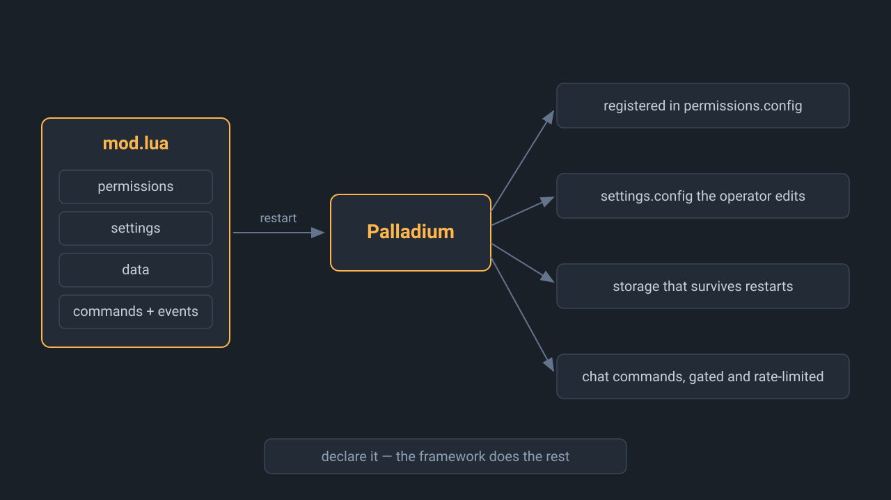
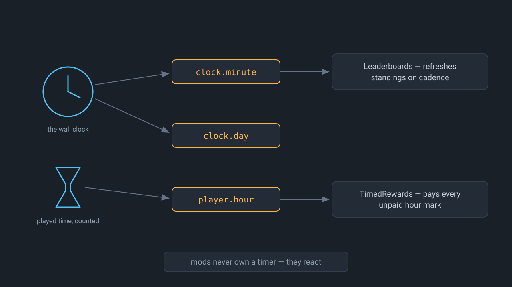
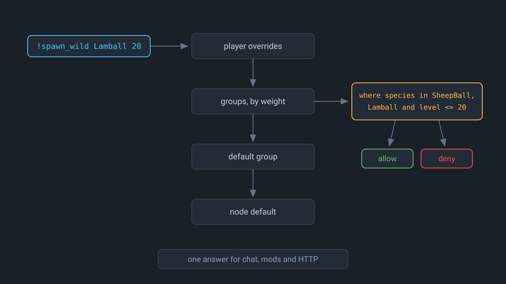

# Mods — folder conventions & how loading works

## The mod types (and where they go)

| Type | Looks like | Drop into | Loaded by | Needs UE4SS |
|---|---|---|---|---|
| **Palladium mod** | folder with `mod.lua` | `./mods/<ModName>/` | Palladium, inside the game | yes (via Palladium) |
| **Lua** | folder with `scripts/main.lua` | `./mods/<ModName>/` | UE4SS directly | yes |
| **Script** | folder with `mod.json` | `./mods/<ModName>/` | the panel, outside the game | no |
| **Loose .pak** | a single `SomeMod_P.pak` (sometimes with `.ucas`/`.utoc`) | `./paks/` | the stock pak system | no |
| **LogicMod** (Blueprint) | a `.pak` the author calls a LogicMod / BP mod | `./logicmods/` | BPModLoaderMod | yes |

**A Palladium mod is the one to write.** It needs nothing but Palladium — no
panel, no token, no process — and it reaches the engine, which is where mods
belong. A raw Lua mod is what you write when you need UE4SS directly and want
no framework. A script mod runs outside the game against the HTTP API, which is
the right shape for a bot, a Discord relay or anything that has to reach the
network — the game process cannot.

Rules of thumb when a download page doesn't say which type it is:

- Archive contains `scripts/main.lua` (or `main.lua` + `enabled.txt`) → **Lua**.
- Archive contains only a `.pak` (± `.ucas`/`.utoc` siblings) and the page
  says "LogicMods folder" → **LogicMod**; otherwise → **loose .pak**.
- Archive contains a `dlls/` folder → Windows-only C++ mod, **will not work**
  (see below).

## Writing a Palladium mod

One file. `mods/GoldStreak/mod.lua` returns a table, and that table is the
whole mod — what it is, what it owns, and what it does:



```lua
return {
    name = "GoldStreak",
    version = "1.0.0",
    description = "Gold for sticking with it: a reward on every fifth respawn.",

    permissions = {
        { node = "goldstreak.reward", description = "earn gold on a respawn streak", default = "allow" },
    },
    settings = { every = 5, item = "Money", count = 50 },

    on = {
        ["player.respawn"] = function(event, pal)
            local who = event.subject.id
            if not pal.can(who, "goldstreak.reward") then return end
            local streak = (tonumber(pal.tag(who, "respawns")) or 0) + 1
            pal.set_tag(who, "respawns", streak)          -- outlives the restart
            if streak % pal.settings.every ~= 0 then return end
            pal.give(who, pal.settings.item, pal.settings.count, function(ok)
                if ok then pal.message(who, "Here is your gold.") end
            end)
        end,
    },

    commands = {
        ["!streak"] = {
            description = "how many respawns until the next payout",
            run = function(event, args, pal) pal.message(event.subject.id, "…") end,
        },
    },
}
```

Drop the folder into `./mods` and restart the server. Palladium finds it,
loads it, registers `goldstreak.reward`, and starts calling it. There is no
`permission.register` to remember, nothing to connect to, and no process to
run.

The manifest is Lua rather than JSON for a reason worth knowing: Palladium can
*write* JSON but has no parser to read it. A Lua table needs no parser — the
call that loads the file is the call that reads the manifest.

| Key | Meaning |
|---|---|
| `name` | Must match the folder name |
| `permissions` | Nodes the mod owns, each with a description and a default. They must start with the mod's own lowercased name |
| `settings` | Free-form table, reachable as `pal.settings` — the author's defaults; see the overlay below |
| `on` | One function per event type — `player.join`, `player.chat`, `player.death`, `player.respawn`, `player.leave`, `npc.spawn`, `player.hour` (a played hour completed), `clock.minute` and `clock.day` (server-local wall clock), `player.item_use` (experimental). Each event's `subject` and `data` fields, with their types, are in [bridge-reference.md](bridge-reference.md) |
| `commands` | Chat commands, each with a `run` and optionally a `node` to gate it |



### What `pal` offers

Two layers, and the difference matters.

**Every capability, under the manifest's own name.** What chat calls
`!give_item` and HTTP calls `player.give_item` is `pal.player.give_item` here,
with the same parameters and the same permission node. The table is built from
the generated manifest at load time, so a capability cannot answer to one name
in one place and another name here, and a capability added to the manifest
needs no framework code to reach mods:

```lua
pal.player.give_item(who, { item = "PalSphere", count = 5 }, function(ok, err, data) … end)
pal.player.teleport(who, { to = other })
pal.pal.spawn_wild({ species = "BlueDragon_Ice", level = 20, aggressive = true })
pal.server.announce({ message = "the world boss is up" })
pal.permission.check(who, { node = "kits.daily" }, function(ok, err, data) … end)
```

An id comes first when the call names someone, and is simply left out when it
does not — `pal.server.announce({ … })`. `done` is optional and receives
`(ok, err, data)`; actions reach the engine on the game thread, so an answer is
never available on return. Every name and parameter is in
[bridge-reference.md](bridge-reference.md), including the payload of each event
your `on` handlers receive.

**And the framework's own services**, which are not capabilities and so keep
their own names:

| Call | Does | Why it is not a capability |
|---|---|---|
| `pal.call(type, userid, params, done)` | Any capability by its full name | The generic form of the table above |
| `pal.give(userid, item, count, done)` | Hands over items **and reads the inventory back**, so `done` learns whether they arrived | A composition of `player.count_item`, `player.give_item` and `player.count_item` — the engine reports success for an unknown item id having added nothing |
| `pal.can(userid, node)` | May this player? | Resolves in-process and answers immediately; `permission.check` is a queued call |
| `pal.tag(userid, key)` · `pal.set_tag` · `pal.delete_tag` | A stored value per player, surviving restarts | Namespaced to your mod, so two mods can both keep a `count`. `player.get_tag` reads the raw, shared key instead |
| `pal.data(name)` | A handle on one of your declared collections | Scoped to your mod. `pal.data.list` and friends are the capabilities, over any collection |
| `pal.settings` · `pal.log` · `pal.name` | Your settings, your log line, your name | Framework state, not engine calls |

`pal.message`, `pal.heal` and `pal.announce` still work and say once in the log
that they have moved — they were `player.message`, `player.heal` and
`server.announce` under invented names, which is exactly the drift the one
manifest exists to prevent.

### The operator's settings.config

The `settings` table in `mod.lua` is the author's defaults. The operator's
word is `settings.config` beside the mod's data — it survives mod updates,
and it is re-read within seconds of an edit, so tuning a reward needs no
restart. A mod may ship a commented `settings.example.config` next to its
code; on the first load that finds no live `settings.config`, the example
becomes it — a fresh install gets a real file to open, already explaining
itself, and updates only ever refresh the example, never the operator's
copy. Plain `key = value` lines; dotted keys reach into tables and numeric
segments make list positions:

```ini
; mods/TimedRewards/settings.config
rewards.1.hours = 1
rewards.1.item = Money
rewards.1.count = 250
```

Any top-level key the file mentions replaces that default wholesale — a
half-merged list surprises everyone. `true`/`false` and numbers coerce,
everything else stays text. A mod that reads `pal.settings` at use time sees
edits immediately; one that copied a value into a local at load keeps the old
value until the next boot.

Answers arrive through a callback rather than a return value, because actions
run on the game thread and some of them defer past it. The callback is given
`(ok, err, data)`, where `data` is the result's fields by name.

`pal.can` resolves against `permissions.config`: the player's overrides first,
then their groups by weight, then the default group, then the node's registered
default — an exact node beating `kits.*` beating `*`, with deny winning ties.

There is one set of permissions and one file. A mod asks in-process, the panel
and script mods ask through `permission.check`, and an operator edits the file
by hand. All three see the same answer.

## Every mod keeps its own files

A mod's config and its records live **in its own folder**, beside the code:

```
mods/GoldStreak/
├── mod.lua                 the mod — replaced when you update it
├── goldstreak.config       your settings for it, if it declares any
└── goldstreak.data         its records
mods/Palladium/
├── permissions.config      groups, grants and node defaults — central
└── bridge.data             the player registry, tags, locations, species
```

Updating a mod means unzipping the new folder over the old one, and a release
archive contains only what the author shipped — never the generated files — so
your config and its data survive. Deleting the folder is a complete uninstall.

Permissions stay in one file rather than one per mod: a group spans every mod,
so splitting membership across them would leave no answer for which copy wins.
A mod still ships its *node declarations* in `mod.lua`, which is what you read
before installing it.

## permissions.config



`mods/Palladium/permissions.config`, written by Palladium and yours to edit:

```ini
; groups: what they allow and deny, and which one everybody is in
[groups default]
deny = goldstreak.reward
is_default = true
weight = 0

[groups vip]
allow = kits.daily
allow = pal.spawn where species in SheepBall,Lamball
tag = VIP
weight = 10

; every permission node the installed mods registered, and its default
[nodes]
goldstreak.reward = allow    ; earn gold on a respawn streak
welcomekit.kit = allow       ; receive the starter kit on first join

; per-player group membership and overrides, by 32-hex player id
[players F8EAA197000000000000000000000000]
deny = welcomekit.kit
groups = vip
```

- **`[nodes]` fills itself in.** Install a mod, restart, and everything it can
  gate is listed with the default it asked for.
- **Your change to a default wins.** A mod re-registering on every boot will not
  put its own opinion back over yours.
- **Edits are picked up within seconds**, no restart. Writes from the panel or a
  mod rewrite the file and keep records you added by hand.
- Comments do not survive a rewrite — same deal as `mods.txt`.
- **A wrong edit is reported, never silently dropped.** A section naming no
  collection, a field that is not declared, a value of the wrong type or a line
  that is not `key = value` is logged with its line number and shown on the
  mods page — with the near miss named, since it is nearly always a typo. What
  parses is still loaded: one bad line must not cost you the file.
- **A constraint narrows a grant** to the calls that satisfy it:

  ```ini
  allow = pal.spawn where species in SheepBall,Lamball
  allow = pal.spawn where level <= 20 and rare = false
  allow = player.teleport where x >= 0 and x <= 1000
  ```

  Operators: `in` (comma-separated), `=`, `!=`, `<`, `<=`, `>`, `>=`, joined
  with `and`. Matching happens in the agent, so a mod calling
  `pal.can(who, node, params)`, the `!pal.spawn` command and an `as:` call over
  HTTP all get the same answer. A constrained grant checked *without* the
  parameters answers no — it cannot be relied on, so it is not widened.
- **A chat command also carries who it is aimed at**, so a grant can be
  narrowed by target. `target` is the target's id, spelled `@me` when it is
  the caller; `target_group` and `target_weight` are the target's
  highest-weight group and that group's weight:

  ```ini
  allow = player.heal where target = @me
  allow = player.teleport where target_group != admins
  allow = player.heal where target_group in member,vip
  allow = player.teleport where target_weight < 12
  ```

  The last shape is the hierarchy: a moderator at weight 12 may move anyone
  below 12, never a peer or an admin. Acting on yourself always passes a rank
  constraint — `@me` weighs `-1`, beneath every group — so nobody's own
  commands go dark because of their own rank. Standing is derived inside the
  resolver, so the same entry gives the same answer in chat, from a mod's
  `pal.can`, and from a `permission.check` over HTTP. When a call names a
  *group* (`group.assign`, `group.set_entry`), `group_weight` is that group's
  weight — `allow = group.assign where group_weight < 12` lets a moderator
  promote members without being able to mint another moderator or an admin.
- **Alternatives join with `or`**, and `and` binds tighter:
  `allow = player.teleport where target = @me or target_weight < 5` reads as
  "yourself, or anyone below weight 5".
- **A grant can carry an end date**: `until 2026-09-01` (midnight starting
  that day, server-local) or `until 2026-09-01T14:30`, written after any
  constraint. An expired entry simply is not there anymore:

  ```ini
  allow = player.heal where target = @me until 2026-09-01
  ```

  `permission.grant` and `group.set_entry` take the stamp as their `until`
  parameter.
- **`@Name` targets the online player of that name** (case-insensitive):
  `!teleport @Löyly` and `target=@Löyly` both resolve to their id, and a name
  nobody online carries refuses the command rather than guessing. `@me` stays
  yourself.
- **Writes are audited.** Every write-scope capability run from chat or by a
  mod appends one line to `logs/bridge-audit.log` — when, who (or which mod),
  the action, its target and parameters. The HTTP door's audit lives in the
  panel's database; between the two, every state change has a trail.
  `player.message` is exempt, or every greeting would drown the file.

## Storing anything else

Permissions are three *collections*, and a mod declares its own the same way:

```lua
data = {
    homes = {
        description = "where players set their home",
        fields  = { x = "number", y = "number" },
        storage = "data",     -- or "config", for a file you mean to hand-edit
    },
},
```

```lua
local homes = pal.data("homes")
homes:set(who, { x = "120.5", y = "88.0" })
homes:get(who)   homes:all()   homes:delete(who)
```

| `storage` | Kept in | For |
|---|---|---|
| `data` | the append log, indexed in memory | thousands of records nobody hand-edits |
| `config` | `mods/<Mod>/<mod>.config` | a handful an operator owns |

Declaring is what makes a collection discoverable: `data.collections` lists
every one with its owner, storage class and field shape, and `data.list`,
`data.get`, `data.set` and `data.delete` read and write any of them — so the
panel, a CLI and an external program all change values through one door. Only
the owning mod can open its own collections from Lua.

`data.set` carries a record's fields as ordinary call parameters
(`collection=shop.listings record=L1 item=PalSphere price=500`), because this
runtime has no JSON parser. List-valued fields cannot be set that way yet.

### Every capability is also a command

`!pal.spawn species=Lamball level=20` in chat makes the same call the HTTP door
makes, gated by the same permission node — and those nodes are registered
`deny`, so out of the box this is an admin surface and nothing else. Grant
`pal.spawn` to a moderators group and its members get the command; nobody else
sees anything change.

- Every capability answers to its short name when no other capability ends the
  same way: `!heal` is `!player.heal`, `!teleport` is `!player.teleport`.
  `!stats` stays ambiguous, so the full `!player.stats` or `!pal.stats` it is.
- Parameters are `key=value`, the same shape the action queue carries — or
  positional, matched to the declared parameters by kind:
  `!pal.spawn IceDrake 25 [WorldTree_ATK]` reads species, level and traits in
  order, numbers seeking number-shaped parameters and `[bracketed]` values
  seeking string-shaped ones.
- `@me` anywhere means the caller's own player id.
  `target=<32-hex id>` acts on somebody else; without it the caller is the
  target.
- `!commands` lists every word the caller may actually use — mod commands and
  capabilities alike, filtered by the caller's own permissions.
- `?<command>` explains one: declared parameters, kinds, ranges and defaults.
  A mod command answers with its `help` text when the mod declares one.
- A mod's own command wins over the built-in of the same name, so a mod can
  offer a friendlier `!spawn` without taking `!pal.spawn` away.
- One command per player per two seconds, refusals included.

### Writing a mod against a version of this

A mod may declare which shape of the framework it was written against:

```lua
return { name = "Kits", api = 1, … }
```

Declaring nothing means "whatever is current", which is the honest reading of
every mod written before there was a number. A mod asking for an API this
Palladium does not speak is refused with the reason, rather than loading and
misbehaving where the author cannot see it.

### How mods are found, loaded and isolated

- Every mod's records live in `mods/<Mod>/<mod>.data` — tab-separated,
  appended and periodically rewritten, since this runtime has no JSON parser
  and no database. A line torn by a crash is dropped and the file healed on the
  next load. On Pal-Up the loader reads an rsync copy of the mod folders, so
  Palladium writes to the originals instead; `PALLADIUM_MODS_SOURCE` names
  them, rather than the framework guessing and risking a write that the next
  boot's sync undoes.
- Palladium reads `Mods/Palladium/mods.list` for the names to load. Pal-Up
  regenerates it on every boot from `./mods`, honouring `.disabled` markers; a
  standalone server maintains it by hand, exactly like BPModLoaderMod's
  `load_order.txt`. If the file is absent, Palladium falls back to asking the
  loader for a directory listing.
- Each mod is loaded with its own environment: it reads every global it needs
  and writes only to itself, so a mod that assigns a global cannot disturb
  Palladium's.
- Every handler runs under `pcall`. A mod that throws is named in the log with
  its reason, and the next mod still gets the event.
- Events are queued when they are published and delivered when the action poll
  drains the queue, so mod code never runs inside an engine hook. A slow
  handler delays other mods; it does not stall the game.
- A mod that does not load — no table returned, a syntax error, a permission
  node outside its namespace — is reported and skipped. Nothing else changes.

### Writing a script mod instead

A mod that must reach the network cannot live in the game process: UE4SS Lua
has no sockets. That is what script mods are for — a folder with a `mod.json`
and an entry file in JavaScript or TypeScript, run by the panel, with
permissions and tags reached through the same capabilities.
The client one runs against is [packages/mod-sdk](https://github.com/s-kiu/Palladium/tree/main/packages/mod-sdk), which
documents what a mod exports and everything `pal` offers on that side. Script
mods need Pal-Up; Palladium mods do not.

## How the Lua half is loaded

Sync happens on every container start: `docker compose restart palworld`
after changing mod folders. Mods removed from `./mods` are removed from the
server; folders Pal-Up didn't put there (UE4SS's bundled mods) are left
alone. Folders with a `mod.json` and no `scripts/` are skipped — they have no
Lua half, and the panel is already running them.

## Enabling / disabling

`server/Mods/mods.txt` is regenerated on every boot (`MODS_TXT_MODE=managed`):
UE4SS's bundled defaults + every folder in `./mods` that has a Lua half,
enabled unless a `.disabled` marker exists:

```bash
touch mods/CoolMod/.disabled     # keep the files, skip loading
rm    mods/CoolMod/.disabled     # re-enable
docker compose restart palworld
```

The same marker governs the other two kinds. A Palladium mod is left out of the
`mods.list` Palladium reads, so it stops loading on the next restart; a script
mod stops or starts on the spot, since the panel owns its process and the
toggle button writes the marker for you.

This kills the classic "my mods.txt reset after restart" problem: the file is
*supposed* to be regenerated — from state you control. Power users who want
exotic load orders set `MODS_TXT_MODE=manual` and own the file themselves.

Note: some mods ship an `enabled.txt` that would force-enable them in UE4SS
regardless of `mods.txt`. In managed mode Pal-Up strips that file from the
synced copy so the enable/disable toggle always wins (your folder in `./mods`
is left as downloaded). In `MODS_TXT_MODE=manual`, `enabled.txt` is preserved
and behaves as UE4SS defines.

## Linux caveats (read before reporting a broken mod)

- **C++ mods must be Linux-native.** The Linux UE4SS cannot load Windows
  `.dll` files; a C++ mod needs to be recompiled by its author as a Linux
  `.so` (loaded from `libs/` instead of `dlls/`). Most aren't (yet).
- **Client-side mods don't belong on the server.** Anything visual (UI,
  textures, models seen only by players) goes on the *player's* machine. A
  server-side mod changes rules/spawns/logic for everyone.
- **PalSchema** mods (JSON-based tweaks) are reported to work on Linux
  servers; treat version compatibility carefully and test — the framework
  itself historically depends on UE4SS.
- **The official Pocketpair mod system** (`Mods/Workshop` + `PalModSettings.ini`,
  added in 1.0) supports **Windows dedicated servers only** — that's exactly
  why this project vendors the community UE4SS Linux port instead. If a future
  patch enables it on Linux, drop your `PalModSettings.ini` into
  `config/persist/` (see below) and it will survive restarts.

## Surviving game updates

Game patches routinely break UE4SS (memory offsets move). Pal-Up's model:

1. Run with `UPDATE_ON_BOOT=hold` — the game version stays put until *you*
   decide, no matter how often the container restarts.
2. When a patch lands, check the [UE4SS Linux port](https://github.com/BlackBookOfficial/ue4ss-linux-palworld)
   for a compatible release, then re-pin: `./packages/server-image/ue4ss/vendor.sh --pin <new-tag>`
   and rebuild the image.
3. `docker compose run --rm palworld update` (auto-backup happens first),
   start, and test with `MODS_ENABLED=true`. If the server crashes on boot,
   flip `MODS_ENABLED=false` to confirm it's mod-related, then bisect with
   `.disabled` markers.

## Files that keep resetting

Any config file the game or a mod regenerates can be pinned: put your copy
under `config/persist/` (inside the data volume) at its server-relative path,
e.g.:

```
config/persist/Pal/Binaries/Linux/PalModSettings.ini
config/persist/UE4SS-settings.ini
```

Persisted files are copied over the server tree on every boot, *after*
Pal-Up's own config generation — your file always wins.

## Mods that talk to the outside world

UE4SS Lua has no network access, so a mod that wants to reach anything outside
the game process has to go through a file on the shared volume. `Palladium`
ships that route for in-game events and the panel serves them over HTTP. That
is why script mods exist at all — see
[writing a script mod instead](#writing-a-script-mod-instead) above, or
[docs/bridge.md](bridge.md) if you are writing a tool rather than a mod.

## Where do I even get mods?

Nexus Mods and CurseForge, "Palworld" section. Pal-Up deliberately has no
automatic downloader (Nexus Mods' API terms restrict automated downloads);
download archives yourself and drop them in.
